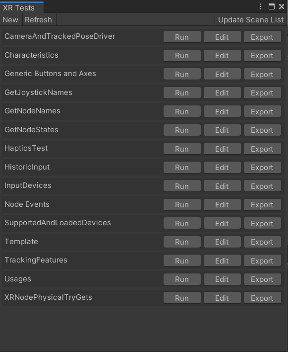
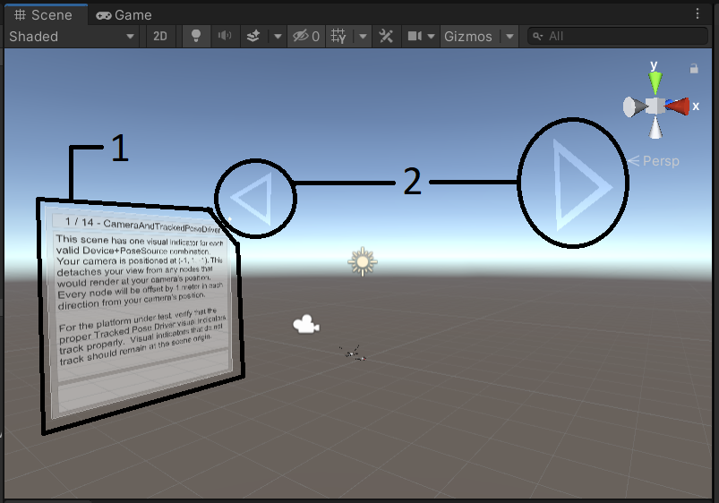

# XR Input Test Suite

## Running Tests the Editor
One method for running a test is to find the appropriate scene, load it, and enter playmode.  Please also consider using teh XR Tests view.

Start by opening the XR Tests view.  This can be found from the menu bar at `Window -> XR Tests`.  From this menu you can use the provided buttons to set up a test to run, edit, or export.

- "New" creates an empty test scene.  See the section on [Adding a new test](#Add-a-New-Test) for the complete process.
- "Run" loads the scene for a test and enters playmode
- "Edit" loads the scene for a test without entering playmode
- "Export" creates a single-scene project ready to zip up and attach to an issue as a minimum reproduction.
- "Update Scene List" resets the Build Settings to include all tests scenes in the project.

## Running Tests on a Device
Simply compile the project and deploy it to your platform of choice.  Each scene has a pair of arrows.  Gaze at an arrow for a few seconds to transition to the next scene.

## Navigating between test scenes.
Once you have loaded a test scene, you can navigate between scenes using a common navigation path.

- "1" shows the instruction panel.  This panel explains the feature(s) that a scene tests.
- "2" shows the scene navigation arrows.  Centering the camera's cursor on one of these for a few seconds navigates between scenes.

## Add a New Test
To add a test scene within the complete project
- Copy the `Assets/Tests/Template to Assets/Tests/YourNewTestName`
- Rename `Assets/Tests/YourNewTestName/Template.unity` to `Assets/Tests/YourNewTestName/YourNewTestName.unity`
- Add your test-specific GameObjects.  Add new assets for a single test to `Assets/Tests/YourNewTestName/`. Add new assets for use across multiple scenes to `Assets/Tests/_SharedAssets`.
- Add your test-specific instructions to the TestInstructions GameObject in `Assets/Tests/YourNewTestName/YourNewTestName.unity`
- Add your test to the build settings by navigating from the Menu Bar to `Window -> XR Test` and pressing the "Update Build Settings" button.
- You can refresh the XR Tests window using the "Refresh" button located at the top of the window.
- Before committing the new test to source control be sure to verify it by:
  - Running the test in playmode.  Make sure there are no console debug logs, warnings, or errors! Launch the test by pressing the "Run" button under `Window -> XR Tests panel -> YourNewTestName`
  - Running the test in a build
  - Export the test, make sure it works in playmode and as a build - no consolde debug logs, warnings, or errors!  You should be able to navigate between scenes with the arrows forward and backward from the new test.

## Best Practices
- If you are adding a completely new test, add it to the earliest editor branch that supports the feature and graft it forward version branch by version branch.
- Test and double test before committing new changes! This keeps the project nice for everyone!
- Please only add new assets to `Assets/Tests/YourNewTestName/` for your new test or `Assets/Tests/_SharedAsets` for new assets that are to be used across multiple test scenes.
